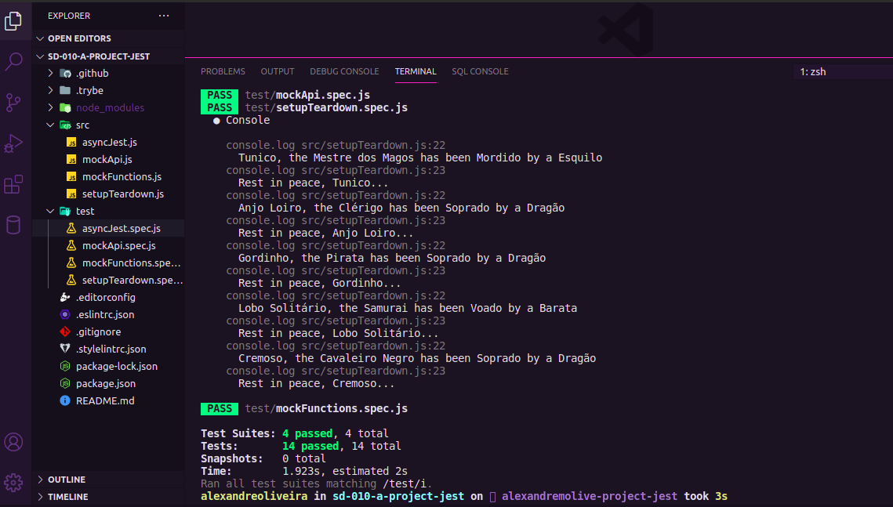

<h1 align="center">
    
</h1>

## **SOBRE**
Projeto criado dentro do módulo de Fundamentos na **Trybe**.

Implementar testes utilizando o **Jest** para verificar se uma série de funções estão funcionando corretamente. Colocar em prática todo o conteúdo que aprendeu sobre Jest assíncrono e Mocks aplicados a testes em Javascript.

### **Habilidades**
- Escrever testes para funções assíncronas;
- Aplicar os seus conhecimentos acerca de testes utilizando o Jest;
- "Mockar" funções;
- "Mockar" APIs;

### **TÉCNOLOGIAS UTILIZADAS**
- JavaScript
- JEST (Framework de testes)

### **OBS:**

Para que o projeto seja avaliado pela Trybe, o código é analisado pelo **ESLint** para garantir que estejam sendo aplicadas as melhores práticas.

